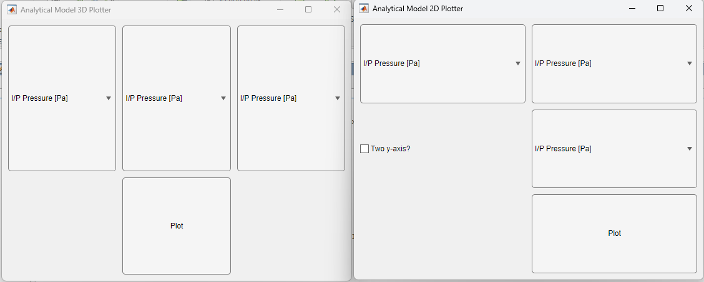

# RDE_bros_analytical_model
This is a matlab based analytical model using the Cantera toolbox which is employed to size various elements of DET's RDRE geometry sizing. 

## Overview
The main files in this repo;
'''
- > Analytical_Model.m
- > Analytical_Model_Plotter.m
'''

Other files that you might want to know about if you need to re-populate the datafile:
> Output_data_combined_all.mat
'''
- > Analytical_Model_Calculator.m
- > matcombiner.m
    - This file combines two .mat files. I used this to combined a dataset collected on lower temperature detonation parameter collection, and another run on high temperature parameter collection (outputs from the 'Analytical_Model_Calculator.m' file.)
- > Output_data_combined_all.mat
'''

For the most part; stay away from all other files in this directory, most are referenced from one of the above four files to generate data, or plots. 

## How it works?

1. Use the 'Analytical_Model_Calculator.m' to populate the Output_data.mat file with the range of parameters you select. This will be done automatically. The only input you need to provide is the range and fidelity of the data to be collected. One of the first few lines in this script is the following; 

'''
Pressure_range=[(0.101325e+6)/2,2.533e+6,(0.101e+6)\]; % low,high,step size % in pascals ~(range 1.5 atm to 25 atm, step 1/2 atm)
Temp_range=[173.15,373.15,10\]; % low,high,step size % in Kelvin
eqv_ratio_range=[0.75,1.15,0.05\];  % low,high,step size %no units
'''

For ease of use; we have a dataset already generated called 'Output_data_combined_all.mat' which has pretty good resolution data across a decently wide range.

2. Use the 'Analytical_Model_Plotter.m' file to open two UI windows. These UI windows allow the user to slect either 2D or 3D output plots of any variables they are interested, across the entire collected range.

Notice the window titles (top left of each window) indicate which type of plots will be generated. To select data, simply click one of "I/P Pressure [Pa\]" buttons and a scrollable dropdown menu will present itself with all of the available variables that can be plotted. 

- On the 3D plotter window, the data axis are X,Y,Z (first, second, third dropdown options)
- On the 2D plotter window, the data axis are X,Y (first, second, dropdown options)
    - IFF the "Two y-axis" box is checked, then the dropdown box to its right will be displayed as a secondary y axis on the right.

For both windows, when you are happy with your variables to plot, click the "Plot" button and a plot with those variables will be displayed. Repeat as many times as you wish, neither the plots nor UI windows will close.

